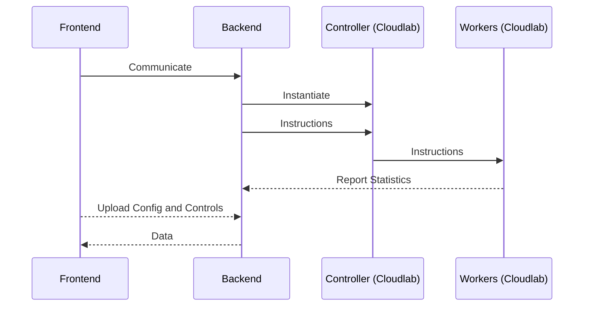

# BFTGym - Demo

## Usage

First launch the backend server:

```bash
$ source venv/bin/activate
$ python main.py --help
usage: main.py [-h] [--host HOST] [--port PORT]

options:
  -h, --help            show this help message and exit
  --host HOST, -H HOST  host of the backend, default to be 0.0.0.0
  --port PORT, -p PORT  port of the backend, default to be 8999
```

Then launch the gradio frontend:

```bash
$ source venv/bin/activate
$ python interface.py --help
usage: interface.py [-h] [--fault FAULT] [--backend BACKEND]

options:
  -h, --help            show this help message and exit
  --fault FAULT, -f FAULT
                        f in BFT system, default is 1
  --backend BACKEND, -b BACKEND
                        backend server, default is localhost:8999
```

The default config file is `default.yaml`.

## Data flow


